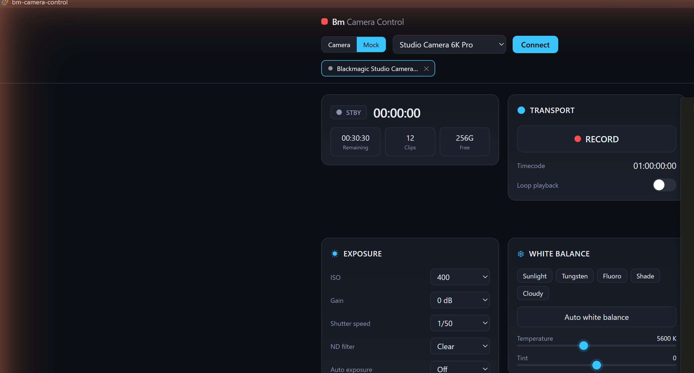

# Bm Camera Control

**English** | [日本語](README.ja.md)

A cross-platform (Windows / macOS) desktop app to control Blackmagic cameras
over the **Camera Control REST API + notification WebSocket**. Built fresh with
Tauri 2 + React + TypeScript. The UI is **capability-driven**: it shows only the
controls the connected camera actually advertises, so the same app adapts to
each model automatically.



> Unofficial, third-party tool — not affiliated with or endorsed by Blackmagic Design.
> Spec reference: `RESTAPIforBlackmagicCameras.pdf` (Blackmagic Developer Information, Aug 2025).

## Why a desktop app (Tauri)?

Cameras serve the API over HTTPS with a **self-signed certificate**. A plain
browser app trips over CORS and certificate-trust prompts. Here the **Rust
backend** proxies all REST + WebSocket traffic (`src-tauri/src/camera.rs`),
accepting the self-signed cert and bypassing CORS entirely — the front-end never
talks to the camera directly.

## How feature-gating works

On connect the app builds a capability set from the camera itself — no per-model
hardcoding:

- `GET /system/product` → model + firmware
- WebSocket `listProperties` → the exact properties this unit supports
- `GET /video/supportedISOs`, `…/supportedShutters`, etc. → option ranges

Each control in `src/api/registry.ts` is tagged with the property that gates it;
`src/components/Panel.tsx` hides anything the camera doesn't expose.

## Architecture

```
src-tauri/src/camera.rs   Rust: HTTP proxy + WebSocket relay (self-signed TLS ok)
src/api/                  transport (Tauri/mock), control registry
src/store.ts              Zustand store + connect/subscribe/capability flow
src/components/           panels, widgets, color wheels, API console
src/mock/profiles.ts      spec-accurate mock cameras for offline development
```

The transport is abstracted (`src/types.ts: Transport`): a **TauriTransport** for
real cameras and a **MockTransport** for offline work. In a plain browser the app
defaults to Mock; inside the Tauri shell it can connect to real hardware.

## Prerequisites

- Node.js 18+
- Rust (stable) — install via <https://rustup.rs>
- **Windows**: MSVC C++ Build Tools + WebView2 (preinstalled on Win 11)
- **macOS**: Xcode Command Line Tools (`xcode-select --install`)

## Develop

```bash
npm install
npm run tauri dev      # desktop app against a real camera
npm run dev            # browser only (Mock mode), http://localhost:1420
```

## Build

```bash
npm run tauri build    # native installer for the current OS (Win .msi / macOS .dmg)
```

## Connecting to a real camera

1. In **Blackmagic Camera Setup**, enable network access (web media manager) and
   generate the HTTPS certificate. Firmware 8.6+.
2. Launch the app, switch the source toggle to **Camera**, enter the hostname
   (e.g. `studio-camera-6k-pro.local`), keep HTTPS on, and Connect.

## Discovery & multi-camera

- **Scan network** (desktop) finds cameras by probing the local /24 for the REST
  API (`discover_cameras` in `src-tauri/src/camera.rs`). This is used instead of
  mDNS because host firewalls commonly block inbound UDP 5353; a direct HTTP probe
  is reliable. Discovered/recent cameras appear as one-click connect chips.
- **Control tabs** — every connected camera is a live session (its own websocket +
  state) shown as a tab. Switch tabs instantly with no reconnect; each tab keeps
  its own live data and ON AIR / PROGRAM-guard state. The store holds a
  `sessions` map + `activeId`, mirroring the active session to top-level fields so
  panels stay simple (`src/store.ts`, `src/components/TabBar.tsx`).
- **Copy look → others** applies the active camera's look to every other connected
  tab (skipping unsupported settings) — one-action multi-cam colour match.
- **Fleet view** (header ▦) shows a tally wall of cameras polled simultaneously
  (PGM/PVW, REC, battery, online); **Control** opens that camera as a live tab.
  (`src/fleetStore.ts`, `src/components/FleetWall.tsx`.)

## Reliability & safety

- Writes are **serialised per endpoint** with a 409 retry.
- **Auto-reconnect** re-establishes the websocket if it drops (real camera).
- **Recent cameras** are remembered for quick reconnect.
- **PROGRAM guard**: while a camera's tally is Program (or recording), the first
  image-affecting edit asks for confirmation, then unlocks for the session;
  re-arms when the camera leaves Program. Toggle in the header while live.

## Auto WB / AF and per-output monitoring

- One-tap **Auto white balance** / **Auto focus** (`/video/whiteBalance/doAuto`,
  `/lens/focus/doAutoFocus`).
- **Output Monitoring** panel: per physical output (HDMI / SDI / USB-C) toggles for
  zebra, false colour, focus assist, display LUT, clean feed, frame grids, safe area.

## Scenes

In-app **named scenes** (localStorage, one-tap recall) alongside file save/load,
plus a **Recording HUD** (elapsed, remaining record time, clip count, free space).

## Scene save / load

The header has **Save scene** / **Load scene**. Save exports the camera's
adjustable *look* settings — exposure, white balance, colour correction,
monitoring, audio, and camera display options — to a portable JSON file
(`src/config.ts`). Loading a file re-applies those settings to the connected
camera, **skipping anything the camera doesn't support** (so a file is portable
across models). Physical/stateful/destructive things (transport, lens position,
recording format, media format, slate metadata) are intentionally **not** saved,
so loading a scene never starts a recording or reformats a card. Save uses a
browser/webview download; if the desktop build doesn't prompt, wire the Tauri
`dialog`/`fs` plugins.

## Internationalisation

UI defaults to **English** and switches to **Japanese** via the header toggle
(persisted to `localStorage`). Strings live in `src/i18n.ts` (`useT()` hook);
add a language by extending the `STR` table.

## Status

Implemented: connection + capability detection, Transport, Lens, Exposure
(incl. detail sharpening), White Balance, Color (LGGO wheels), Monitoring,
Audio (input source / level / +48V / low cut / padding), Livestream, **Record
format** editor (`/system/format` + `/system/supportedFormats`, explicit Apply),
Presets, Status/Tally (+ color bars, program feed, power readout mode),
**Slate / Metadata** editor, **Media** (slots / working set / two-step destructive
**format** behind a confirm), plus an **API Console** that reaches any endpoint not
yet given a dedicated widget. Writes are **serialised per endpoint** with a 409
retry (some endpoints, e.g. `/slates/nextClip`, reject concurrent PUTs). Adding
more dedicated controls is a matter of appending entries to `src/api/registry.ts`
(or a custom panel for nested resources like slates / format / media).

Verified **end-to-end against real hardware** — a Micro Studio Camera 4K G2
(FW 9.6.2) over HTTP: capability detection, all panels live, model-based feature
gating, and write round-trips (safe-area slider and nested slate metadata, both
confirmed via independent `curl`). Note: connect over HTTP for this model — its
HTTPS endpoint requires authentication (returns 401). Known minor: the camera can
return a transient 409 on rapid successive slate PUTs; serialising slate writes
would harden this.
